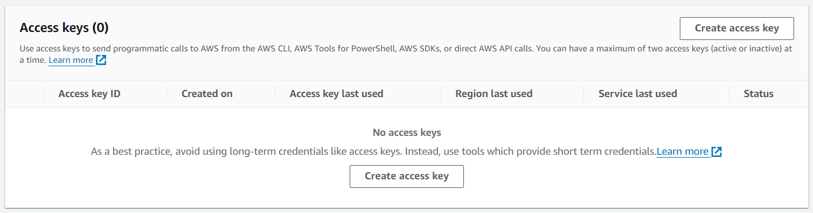
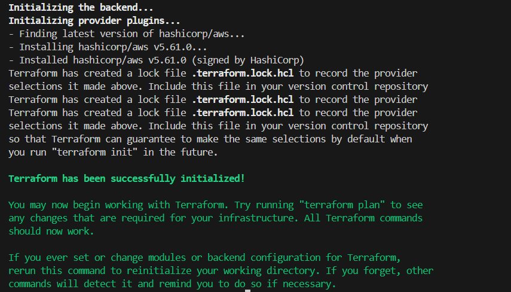
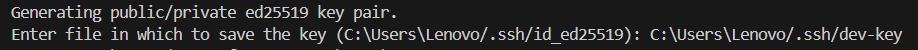
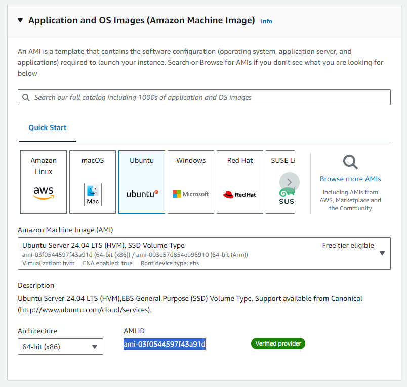

# Managing AWS Infrastructure with Terraform: A Step-by-Step Guide

### Introduction

In this article, we will use Terraform to manage AWS infrastructure. By the end of this article, you will be able to create and manage AWS resources such as VPCs, subnets, and EC2 instances, and automate the process of setting up and tearing down your infrastructure.

### Prerequisites:

1. Terraform is installed on your system
    - If not installed, you can refer to this [documentation](https://developer.hashicorp.com/terraform/tutorials/aws-get-started/install-cli).
2. AWS Account 
    - Most of the resources created are available with a free tier subscription.
    - To create AWS account, you can refer to this [documentation](https://aws.amazon.com/resources/create-account/).

### Sections:

1. Terraform Basics (required for this project)
2. Initialize Terraform with AWS Provider
3. Creating necessary resources to allow SSH to AWS EC2 instance
4. SSH to AWS EC2 instance
5. Destroy all resources

### 1. Terraform Basics

In this section, We will look at

1. Provider Block
2. Initialize Terraform
3. Resource Block
4. Plan and Apply Resource
5. Destroy Resource

**1.1. Provider Block**

The Provider Block allows us to download code for specific resource providers as per our needs, making Terraform a lightweight and quick-to-setup IaC tool.

Let’s look at base structure of provider block:

```jsx
provider "provider-name" {
	...
}
```

- `provider` - is a keyword that helps terraform identify the type of block.
- `provider-name` - determines which provider to be used. You can find all providers [here](https://registry.terraform.io/browse/providers).

**1.2. Initialize Terraform**

After mentioning all providers inside tf script, run:

```bash
terraform init
```

This will look for all providers and download the code so Terraform can work with their APIs.

**1.3. Resource Block**

Let’s look at base structure of resource block:

```jsx
resource "provider_resource-name" "name" {
	...
}
```

- `resource` - is a keyword that helps Terraform identify the type of block.
- `provider_resource-name` - the name of the resource we want to work with.

For example, if we want to create VPC in AWS, as the provider name of AWS is “aws” and the resource name is “vpc” we will right it as:

```jsx
resource "aws_vpc" "name" {
	...
}
```

- `name` - this name is used inside Terraform to uniquely identify the resource. The scope is only inside Terraform.

**1.4. Plan and Apply Resource**

After creating resources, run: 

```bash
terraform plan
```

This will provide a detailed output of changes that will be done as per your current Terraform files.

Its best practice to run this before applying the resources.

After verifying the plan, proceed to apply it:

```bash
terraform apply
```

This will apply the changes and create resources. For us, AWS resources.

To apply a specific resource, use:

```bash
terraform apply --target resouce.name

example:
terraform destroy --target aws_vpc.vpc
```

The above example will only apply the changes to `aws_vpc` resource named “vpc”.

**1.5. Destroy Resource**

If we want to destroy all resources, use:

```bash
terraform destroy
```

To destroy a specific resource, use:

```jsx
terraform destroy --target resource.name

example:
terraform destroy --target aws_vpc.vpc
```

The above example will only destroy the `aws_vpc` resource named “vpc”.

### 2. Initialize Terraform with AWS Provider

In this section, we will:

1. Create access_key from AWS Console.
2. Initialize the AWS Provider.

**2.1. Create an `access_key` from the AWS Console**

- Login to the AWS Console.
- Under your Profile > Security credentials or go to [Security credentials page](https://us-east-1.console.aws.amazon.com/iam/home#/security_credentials).
- Scroll till you see “Access keys” and click on “Create access key”.
    
    
    
- If you see warning with “Root user access keys are not recommended”, click on the checkbox and create the access key.
- Download the .csv file and save it, as AWS will not show the secret key again on the Console for security reasons.

**2.2. Initialize AWS Provider**

- Create a directory at your desired path, and create a **providers.tf** file inside it.
- To add AWS provider, use Terraform’s provider block as shown below:
    
    ```jsx
    provider "aws" {
    	region = ""
    	access_key = ""
    	secret_key = ""
    }
    ```
    
    - `region` - add the region based on your location as preferred by AWS.
    - `access_key` & `secret_key` - add the access key and secret key from the .csv file.
    
    There are multiple ways to add AWS access keys in Terraform. Here we are adding it directly in our Terraform file (not recommended).
    
    To read about different ways to add AWS access keys in Terraform, refer to this [documentation](https://registry.terraform.io/providers/hashicorp/aws/latest/docs).
    
- Open terminal, change directory to the one with the **providers.tf** file, and run:
    
    ```bash
    terraform init
    ```
    
    This will download the necessary code required to use AWS APIs from Terraform.
    
    You should see an output like this:
    
    

### 3. Creating Necessary Resources to Allow SSH to AWS EC2 Instance

In this section, we will create the following resources:

1. `aws_vpc` - a Virtual Private Cloud/Network in which all our resources will be hosted.
2. `aws_subnet` - a smaller chunk of network in which we will host our EC2 instance.
3. `aws_internet_gateway` - it will allow traffic between EC2 instance and the Internet.
4. `aws_route_table` - a set of rules for routing traffic from the subnet.
5. `aws_route_table_association` - to associate the route table with the subnet.
6. `aws_security_group` - a set of rules that determine which traffic is allowed from and to the EC2 instance.
7. `aws_key_pair` - allows SSH to the EC2 instance.
8. `aws_instance` - AWS EC2 instance.

We will create all this resources in a separate file. Create a file named main.tf inside the same folder.

> 💡 Make sure to apply resources and verify them in the AWS Console after each resource creation.

**3.1. Creating `aws_vpc`**

```jsx
resource "aws_vpc" "vpc-dev" {
	cidr_block = "10.0.0.0/16"
	
	tags = {
		Name = "dev"
	}
}
```

- `cidr_block` - to determine the range of network.
- `tags` - add tags to resources for unique identification. This tag will show in the AWS Console.

> 💡 If you want to ‘terraform apply’ without the prompt, use:

```bash
terraform apply -auto-approve
```

**3.2. Creating `aws_subnet`**

```jsx
resource "aws_subnet" "subnet-dev" {
	vpc_id = aws_vpc.vpc-dev.id
	cidr_block = "10.0.0.0/24"
	map_public_ip_on_launch = true
	availability_zone = "ap-southeast-2a"
	
	tags = {
		Name = "dev"
	}
}
```

- `vpc_id` - used to identify the VPC in which our subnet will be created.
    
    To view this `vpc_id` use:
    
    ```bash
    terraform state show aws_vpc.vpc-dev
    ```
    
    From the output, you will see `id = “<some id>”`.
    
- `cidr_block` - to determine the range of subnet.
- `map_public_ip_on_launch` - assign a public IP to the instance launched inside this subnet.
- `availability_zone` - determines the specific zone in which to deploy the subnet. You can use the region you specified in the provider and add “a” at the end of it.

**3.3. Creating `aws_internet_gateway`**

```jsx
resource "aws_internet_gateway" "igw"{
	vpc_id = aws_vpc.vpc-dev.id
	
	tags = {
		Name = "dev"
	}
}
```

> 💡 Keep applying resources and check in the AWS Console.

**3.4. Creating `aws_route_table`**

```jsx
resource "aws_route_table" "route-table-dev" {
	vpc_id = aws_vpc.vpc-dev.id
	
	route {
		cidr_block = "0.0.0.0/0"
		gateway_id = aws_internet_gateway.igw.id
	}
	
	tags = {
		Name = "dev"
	}
}
```

- `route` block - allows specify different routes (IPv4, IPv6). In the above example, the route block will allow all IPv4 traffic from the `igw` Internet Gateway.

**3.5. Creating `aws_route_table_association`**

```jsx
resource "aws_route_table_association" "rta" {
	subnet_id = aws_subnet.subnet-dev.id
	route_table_id = aws_route_table.route-table-dev.id
}
```

> 💡 All the resources related to VPC - vpc, subnet, route tables, internet gateways, security groups will be shown under the VPC Dashboard in the AWS Console.

**3.6. Creating `aws_security_group`**

```jsx
resource "aws_security_group" "ssh" {
	name = "allow_ssh_traffic"
	description = "Allow SSH"
	vpc_id = aws_vpc.vpc-dev.id

	ingress {
		from_port = 22
		to_port = 22
		protocol = "tcp"
		cidr_blocks = ["0.0.0.0/0"]
	}

  egress {
    from_port        = 0
    to_port          = 0
    protocol         = "-1"
    cidr_blocks      = ["0.0.0.0/0"]
    ipv6_cidr_blocks = ["::/0"]
  }
  
  tags = {
	  Name = "dev_ssh_sg"
  }
}
```

- `name` & `description` - are metadata and will be shown in the AWS Console.
- `ingress` block - used to define inbound rules (traffic coming to the server).
- `egress` block - used to define outbound rules (traffic going from the server).

**3.7. Creating `aws_key_pair`**

- Use ssh-keygen to create a key pair locally:
    
    ```bash
    ssh-keygen -t ed25519
    ```
    
    Change the key name to `dev-key` and give the full path as shown below as per your username.
    
    
    
    You can leave other prompts as blank and press Enter.
    
    Verify the keys using:
    
    ```bash
    ls C:\Users\username/.ssh/
    ```
    

```jsx
resource "aws_key_pair" "dev-key" {
	key_name = "dev-key"
	public_key = file("~/.ssh/dev-key.pub")
}
```

- `public_key` - passing the recently created public key.

> 💡 To verify `aws_key_pair`, go to the EC2 dashboard > Network & Security > Key Pairs.

**3.8. Creating `aws_instance`**

- To get the AMI ID for the instance, go to the EC2 dashboard > Instances > Launch Instances (Top-Right Corner).
- Under Application and OS Images > Select Ubuntu.
    
    
    
    You will get the AMI ID from here.
    
    There are dynamic ways to fetch the AMI ID. To learn more about it, refer this [documentation](https://registry.terraform.io/providers/hashicorp/aws/latest/docs/data-sources/ami).
    

```jsx
resource "aws_instance" "node-dev" {
	ami = "ami-03f0544597f43a91d"
	instance_type = "t2.micro"
	availability_zone = "ap-southeast-2a"
	key_name = aws_key_pair.dev-key.key_name
	vpc_security_group_ids = [aws_security_group.ssh.id]
	subnet_id = aws_subnet.subnet-dev.id
	
	tags = {
		Name = "dev"
	}
}
```

- `ami` - add the AMI ID that you got from the console.
- `instance_type` - keep it `t2.micro` (its free tier).
- `availability_zone` - keep it the same as the subnet.

### 4. SSH to AWS EC2 instance.

In this section, we will SSH to our created EC2 instance.

- Get the public IP of the EC2 instance:
    
    ```bash
    terraform state show aws_instance.node-dev
    ```
    
    Scroll down and copy the `public_ip`.
    
- Open the terminal and run:
    
    ```bash
    ssh -i C:\Users\username\.ssh\dev-key ubuntu@public_ip
    ```
    
    The path to the SSH key and the `public_ip` will defer based on your system.
    
    If you see any prompt regarding:
    
    The authenticity of host 'public_ip (public_ip)' can't be established.
    
    Type `yes`.
    
    You will be connected to the remote EC2 instance.

### 5. Destroy All resources

> 💡 Now the fun part when practicing, daunting when in production

Before running `destroy`, let’s run: 

```bash
terraform state list
```

This will show all the resources that are created using Terraform. 

Check the output before and after running the `destroy` command to verify proper destruction :)

To destroy all resources, run:

```bash
terraform destroy
```

### Summary:

In this article, we:

- Explored the basics of Terraform, including provider and resource blocks and different Terraform commands.
- Initialized Terraform with the AWS provider.
- Created essential AWS resources:
    - VPC
    - Subnet
    - Internet Gateway
    - Route Table
    - Security Group
    - Key Pair
    - EC2 Instance
- Connected to the EC2 instance via SSH.
- Learned how to destroy created resources.

**Materials used to write this article:**

- https://registry.terraform.io/providers/hashicorp/aws/latest/docs
- https://docs.aws.amazon.com/
- https://youtu.be/SLB_c_ayRMo?si=VI1mDwB8mdFXtmMP
- https://youtu.be/iRaai1IBlB0?si=N6qau7TbrsftJ_z2

**Tags:**

Infrastructure as Code, Terraform, AWS, Cloud Computing