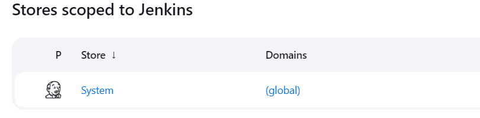

# How to Handle Sensitive Data in Jenkins Pipeline

tags: `CICD`  `Jenkins`  `Security`


## Introduction

In this article, you will learn how to handle sensitive data in Jenkins Pipeline Code.

## Prerequisites:

- Jenkins is Installed and Basic Understanding of Creating Pipeline

## How to Handle Sensitive Data in Jenkins Pipeline:

- [Create Credentials from Jenkins](#create-credentials-from-jenkins)
- [Use Credentials in Pipeline Code](#use-credentials-in-pipeline-code)

### Create Credentials from Jenkins

- Login to Jenkins and Under admin profile click Credentials
    
    

- Click on (global)

    

- Click Add Credentials
- Create any kind of Credentials as per your requirement and give a unique ID. We will use this ID inside Pipeline Code

    

- Here i have given ID to Secret text as CRED_ID

### Use Credentials in Pipeline Code

- Create a pipeline script and use the credentials as shown below

```jsx
pipeline{
  agent any
  environment {
    secure_key = credentials('CRED_ID')
  }
  stages {
    stage('Using Creds in Pipeline'){
      steps {
        sh 'echo $secure_key'
      }
    }
  }
}
```

- Now you can use the credentials as shown above, Create a enviornment variable and use credentials function to fetch the created CRED_ID to your pipeline code.

- The output will be secure as shown below

    
