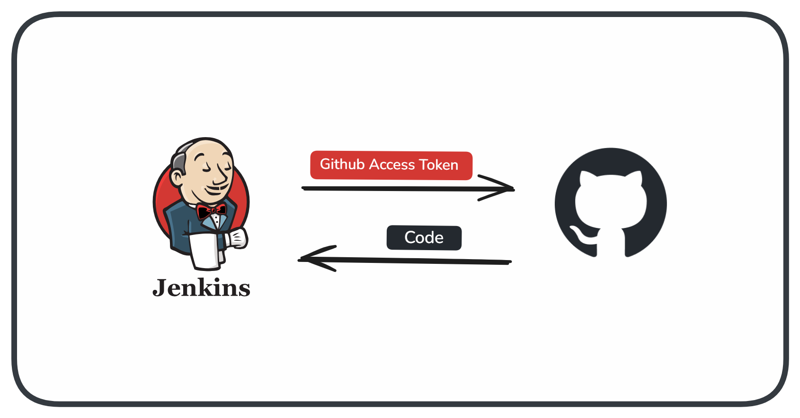

# How to integrate private github repository with Github Personal Access Token in Jenkins Pipeline Job

tags: `CICD` | `Jenkins` | `Github` | `Git`



## **Introduction**

In this article, you will learn how to clone your private github repository in jenkins pipeline using 'Github Personal Access Token'.

## **Prerequisites**

* Basic Understanding of Pipeline Jobs and Pipeline Groovy Scripts

## **Get Personal Access Token from Github**

Visit [https://github.com/settings/tokens](https://github.com/settings/tokens) and Generate new token

Give a suitable name and set expiration as per your requirements

Under Select scopes, check 'repo' and Generate token


Copy the token and keep it in a safe offline place. **You won't be able to see it again!**

## **Add Github Token to Jenkins Credentials**

Visit https://&lt;your-jenkins-home-url&gt;/manage/credentials/store/system/domain/\_/  
you can also refer to this [article](https://jaypnchl.hashnode.dev/how-to-handle-sensitive-data-in-jenkins-pipeline)

Click on 'Add Credentials' on top right corner

Select Kind as 'Secret text'

Paste your Token in Secret field

Give it an ID with which you can refer it in your pipeline


## **Create Jenkins Pipeline Job**

Create a Pipeline Job and use below script for checkout stage

In credentials use the ID which is passed while creating the Credentials

Add the access token before 'github.com' and after 'https://' as shown below

> Make sure to use " " in url as ' ' will not interpret GITHUB\_ACCESS\_TOKEN as a variable

```javascript
pipeline {
    agent any
    
    environment {
        GITHUB_ACCESS_TOKEN = credentials('github-access-token')
    }

    stages {
        stage('Checkout') {
            steps {
                // Get some code from a GitHub repository
                checkout scmGit(branches: [[name: '*/master']], userRemoteConfigs: [[url: "https://$GITHUB_ACCESS_TOKEN@github.com/jaypnchl/twitter-bot.git"]])
            }
        }
    }
}
```